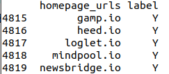
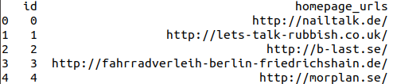
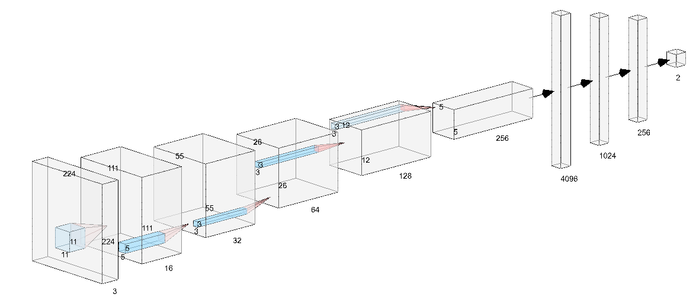

# Startup Recognition using Convolutional Neutral Networks

The Startup-Recognition is an Interdisciplinary Project in an Application Subject (IDP) aiming at creating an AI classifier which will recognize startups, based on their web page design. As the human eye observe a front page of a website and can tell what kind of website it is, we tried to mimic this concept by creating an AI which will simply try to recognize if it is a startup website or not.

The goal of the project is to develop an image classifier that will be used to identify startups by analyzing the design of their web page. We identify a startup as a company not older than 10 years of age and generate innovative solutions, mostly technological. Classification or recognition of startups and non-startups based on screenshots of the startups’ home pages using deep learning algorithm. The result will be used as an additional feature to the INNOSPOT’s internal Startup Classification algorithm.

# Table of contents
* [Architecture Overview](#Architecture_Overview)
* [Datasets](##datasets)
* [Theoretical Foundations](##foundations)
    * [Convolutional Neural Network](###cnn)
    * [Other Well Known CNN](#cnn_others)
    * [AlexNet](#alexnet)
    * [VGG-16](#vgg)
* [Final Concept](#concept)
* [System Design](#system)
    * [Taking screenshots](#screenshottaker)
    * [Preprocessing](#preprocessing)
    * [Predicting class label](#predict)
* [Getting Started](#gettingstarted)
    * [Running the Startup Classifier](#run)
    * [Running the Model Trainer](#train)
* [Known Issues](#issues)
* [Future Works and Conclusion](#conclusion)
* [References and Resources](#reference)

## Architecture Overview

The whole pipeline can be described as the following:

* The Startup Classifier will, at first, grab the screenshots of the given urls (as a list in a csv file) asynchronously.
* Upon finishing the task, it then will run the preprocessor script
The Preprocessor script searches for corrupt/broken images and removes them, along with performing resizing and some slight image transformations to facilitate the training phase
* The Training phase will load the preprocessed screenshots and split them into training, validation and test datasets.
* It then trains on the training set, performs validation on the validation set to measure how well the network generalizes, and then perform test on real world data to properly measure real world performance.
* Upon finishing the training, validation, and test phase, we save the best model, whereas the best model is described as the one that generalizes the dataset best, i.e. that has the lowest loss on validation dataset. 
* Once we have predicted the provided test data, we save the data in a csv file along with the filename (which is the hexcode of the hash of the original url) for easier inference and performance evaluation.
The whole training, validation, test phases can be monitored via TensorBoard.

## Datasets

A rich data set is the basic foundation of our project. The more diverse and unique the data, the better the system will predict the outcome. We have had the data set from Innospot which is already pretty diverse and unique. The data set is sufficient enough to train our startup classifier model and predict the outcome of a new website which is unlabeled. 

We have been provided with 42k (approximately) URLs of labeled websites to capture the home page screenshots and further use them to train our classifier. The data set is consists of both startup and non-startup website URLs. The number of non-startup URLs outweighs the number of startup URLs. We had to tweak our classifier to work around with the class imbalance. The data set contains both high quality and low quality website URLs to make it diverse.

Example of the labeled dataset:

We have also been provided with a data set of unlabeled website URLs to test our classifier and predict the probability of the websites being startups. This data set is similar to the aforementioned data set, but without the Y/N labels.

## Theoretical Foundations 

### Convolutional Neural Network 

A convolutional neural network (CNN) is a type of artificial neural network which is specifically designed to process pixel data and used in image recognition and processing. A CNN consists of one or more layer convolutional layers, followed by one or more fully connected layers as in a standard neural multi-layer network. CNN is designed in a way that can take advantage of the 2D structure of the image as a matrix. This is achieved by applying a weighted filter which is also a smaller matrix all over the image for feature detection and extraction followed by some form of pooling which results in translation-invariant features. CNN's also have the advantage of being more convenient to training and having far fewer parameters than the fully connected networks which have the same number of hidden units.

### Other Well Known CNN

There are many CNN architecture in the community such as LeNet, AlexNet, VGG, GoogLeNet, ResNet. we study only those has good results in ImageNet Large Scale Visual Recognition Challenge (ILSVRC), where software programs compete to correctly classify and detect objects and scenes. Among these well-known networks, we decided to implement Alex-Net and VGGnet based on the initial performance for our dataset and the limitation of our hardware capability. We also implemented our custom architecture and compared the performance of our custom CNN withe the Alexnet and VGG16.

### Alexnet 

Original paper can be read [here.](https://papers.nips.cc/paper/4824-imagenet-classification-with-deep-convolutional-neural-networks.pdf)

AlexNet is the name of a convolutional neural network, designed by Alex Krizhevsky, and published with Ilya Sutskever and Krizhevsky's Ph.D. advisor Geoffrey Hinton.

AlexNet competed in the ImageNet Large Scale Visual Recognition Challenge on September 30, 2012. The network achieved a top-5 error of 15.3%, more than 10.8 percentage points lower than that of the runner up. The original paper's primary result was that the depth of the model was essential for its high performance, which was computationally expensive but made feasible due to the utilization of graphics processing units (GPUs) during training.

The architecture contains eight layers with weights. The first five are convolutional and the remaining three are fully-connected. The output of the last fully-connected layer is fed to a 1000-way softmax which produces a distribution over the 1000 class labels. Softmax takes all the 1000 values, looks at the maximum value and makes it 1 and sets all others to 0. We used the same architecture except for the softmax layer at the end we used 2-way because we only have 2 classes for our prediction

right after the 1st layer we have two parallel paths that are exactly the same. Each path processes a part of the data parallelly. Yet there are some computations that are shared e.g. second, fourth, and fifth convolutional layers are connected only to the same path while the third layer is cross-connected to both paths in the second layer.

AlexNet uses ReLU ( Rectified Linear Unit ) as an activation function that introduces non-linearity instead of TanH which is comparatively slower.

### VGG-16 

Original paper can be read [here](https://arxiv.org/pdf/1409.1556.pdf).

SIMonyan and Zisserman have established the VGGNet which was the runner-up in the ILSVRC 2014 contest. VGGNet consists of 16 convolutional layers and is very appealing because of its very uniform architecture. It has similarities with Alexnet but uses more filters and layers. The preferred way to extract features from images is currently in the community. The VGGNet architecture is available publicly and has been used as a basic feature extractor for many other applications and challenges. But VGGNet has 138 million parameters, which can be a bit difficult to deal with

## Final Concept 

## System Design 

We followed a simple and straight forward approach while designing our system. The three major tasks of our system are the following:

1. Taking screenshots of the provided websites.
2. Processing the screenshots to make them usable in the Neural Net.
3. Predict the outcome of a particular website as a startup or non-startup.

We created three standalone classes to work with the designated interests and finally put them together by simple object calls to the classes.

### Taking Screenshots 

At the start of our system pipeline, comes the ScreenshotTaker class which is solely responsible for crawling through the provided URLs and scraping the homepage screenshots.

ScreenshotTaker:
First off, the ScreenshotTaker class initiates the constructor for the input file path and input file name. It also has two methods for loading the input data and scraping the screenshots.

♦  LinkProcessor(): 

    ◊ This method at first takes the input file in .csv format.

    ◊  Then it transforms all records in the .csv file to a list.

    ◊  It checks if all the URLs already have "http://" scheme at the front or not. If not, it automatically appends the scheme at the front. Otherwise the crawler can not crawl through that particular URL.

♦  ScreenshotModule():

    ◊  This is the main method to scrape screenshots. Library used for scraping screenshots  - asyncio, pyppeteer.

    ◊  The method initiates chromedriver to launch the browser in headless mode. If the system does not have the driver installed, the method initiates the installation process within the given modes at first.

    ◊  It dictates how many loop is needed for batch processing depending on the input file and sets the idle timeout (which can be changed).

    ◊  It tells the browser to visit a particular website and take the screenshot (with dimension 1024 * 1024 ) and save it immediately to the screenshots directory. The format for every image is .jpeg.

    ◊  After saving the screenshot, the browser closes the page right away to reduce CPU usage. It does the same if there is a problem with a particular website.

### Preprocessing 

When the screenshot taking process is done, the PreProcessor class comes into play with the purpose of transforming the images to a usable format.

PreProcessor:
At first this class initiates the constructor for the required directory paths and new dimensions for the images.

♦  ListAllPictures():

    ◊  This method takes the paths of screenshots and processedscreenshots directories as input.

    ◊  It returns a list of all the images stored in the mentioned directories for further processing.

♦  ResizePictures():

    ◊  It takes a list of images from the screenshots directory as an input.

    ◊  It resizes every images in the list to the provided dimension ( provided in the configuration file ). Library used for this operation - Python's PIL

    ◊  Finally the method saves all the resized images to the processedscreenshots directory with the original file name and format.

♦  DeleteWhitePictures():

    ◊  The purpose of this method is to delete images that have too much white pixel presence in them to reduce redundancy of feed forwarding unusable images in the network.

    ◊  It takes a list of images from the processedscreenshots directory as an input.

    ◊  It reads each image in the list as a gray scale image rather than a colored one and counts the number of white pixels in those images. Library used  - opencv for python, numpy

    ◊  The threshold for white_pixel_presence is set to 90%. Any image having more than 90% of white pixels in it, is deleted from the processedscreenshots directory.

    ◊  Finally the processedscreenshots directory contains all the resized and usable images for the network.

### Predicting Class Label 

Finally, after scraping the screenshots and processing them Predictor class is used to predict the outcome of a particular website being a startup or a non-startup.

Predictor:
This class has a helper class to initiate the convolutional network's initial configuration. It initiates the constructor for the directory path, path to model, model name, positive threshold and path to submit the result. 

♦  class Net(nn.Module):

    ◊  It initiates the convolutional layers and max-pooling layers. It also initiates the activation function (softmax).

    ◊  forward()  method returns a variable which has all the sequences, convolutional and max-pooling layers.

♦  ImageLoader():

    ◊  It loads the images from the processedscreenshots directory and converts them to multi-dimensional matrix and return them.

♦  DataTransform():

    ◊  This method normalizes the multi-dimensional matrix which is to be used in the network.

♦  Predict():

    ◊  Firstly, this method initialize the complete Convolutional Neural Network.

    ◊  It loads the chosen classifier model from the models directory.

    ◊  For each transformed image, it predicts the outcome of being a startup or non-startup with help of positive_threshold.

    ◊  Finally the method writes the probability of a website being a startup into a .csv file and saves it in the submission directory. 

## Getting Started 

There are two separate sections of our codebase: The Startup Classifier portion, and the Model Trainer portion. Please note that folder structures and file location needs to be replicated exactly as in the project structure.

### Running the Startup Classifier

Before running the Startup Classifier, we must set up some configuration parameters. All the required parameters can be tuned from the {{configurations.py}} file. Tuning options range from changing file paths, various saved files names to screenshot dimension and batch size. 

Once the configurations have been set up with valid directories and file names, we can run the Classifier. Simply running {{startup_classifier.py}} takes care of the classification task, provided all the files have been placed in their respective folders. The csv file with the predicted output will be placed in the folder specified by the variable {{path_of_submission}} in the configuration file.

### Running the Model Trainer 

Just as the Startup Classifier, we need to set up certain parameters for the Model Trainer as well. All the required parameters can be tuned from the {{configurations.py}} file. Tuning options range from changing file paths, directory/sub-directory structure, batch size, selecting specific architectures etc. 

Once the configurations have been set up properly, we can run the Model Trainer. Simply running the {{startup_classifier_model_trainer.py}} will begin the training process. We can also log into the Tensorboard (running on a localhost) to check out the training statistics and monitor loss/validation curve, gradient flow etc. 

## Known Issues 

* Headless chrome issues
* Pyppetteer Timeout Issues
* EC2 Amazon Linux Dependency issues with Chromedriver
* Issues with Jupyter Notebook and Asyncio

## Future Work and Conclusion 
Identifying websites of a certain category based only on screenshots is a rather challenging task, as we have shown through our experiments and various methodologies. However, there is always more room for experiment, and there are a few avenues we have not explored yet.

Firstly, we can try deeper networks, and ResNet is what comes to mind when talking about Deeper Networks. They handle vanishing gradients problem exceptionally well and thus might be useful in cases where the latent feature is expressed via a complex function [25]. However, we could not explore these very deep networks due to lack of GPU resource. Lack of resource also led to not being able to use Grid Search for parameter tuning. 
Secondly, we can employ other salient features along with the vanilla screenshots, mainly text from the websites. However, instead of scraping for text, we can use OCR. Latest advancements in OCR has made it trivial to extract text from a screenshot [26] and is one potential option that can be looked into in the future. 

In the end, we gleaned into important information regarding the use of Convolutional Neural Networks for website classification tasks via only the screenshot of a specified viewport, and the results of this Interdisciplinary Research Project can pave the way for further interesting and novel projects.

## References 

All the relevant resources and references are linked in the sub-pages of each section. References for the full documentation:
[1] Y. LeCun, B. Boser, J. S. Denker, D. Henderson, R. E. Howard, W. Hubbard, and L. D. Jackel. Backpropagation applied to handwritten zip code recognition. Neural computation, 1989

[2] A. Krizhevsky, I. Sutskever, and G. Hinton. Imagenet classification with deep convolutional neural networks. In NIPS, 2012.

[3] A. Krizhevsky. Learning multiple layers of features from tiny images. Tech Report, 2009.

[4] M. D. Zeiler and R. Fergus. Visualizing and understanding convolutional neural networks. In ECCV, 2014.

[5] J. Deng, W. Dong, R. Socher et al.. Imagenet: A large-scale hierarchical image database. IEEE Conference on Computer Vision and Pattern Recognition, 2009. DOI: 10.1109/CVPR.2009.5206848

[6] INNOSPOT GmbH, https://innospot.de/en/

[7] J. Dysart. A primer for website design. Bioent (2003) doi:10.1038/bioent728

[8] Qi, X., & Davison, B. D. (2009). Web page classification: Features and algorithms. ACM computing surveys (CSUR), 41(2), 12.

[9] All Startup Companies, https://angel.co/companies

[10] Wang J.Z., Li J., Wiederhold G., Firschein O. (1998) Classifying objectionable websites based on image content. In: Plagemann T., Goebel V. (eds) Interactive Distributed Multimedia Systems and Telecommunication Services. IDMS 1998. Lecture Notes in Computer Science, vol 1483. Springer, Berlin, Heidelberg

[11] W. Hu O. Wu et al. Recognition of pornographic web pages by classifying texts and images. IEEE Transactions on Pattern Analysis and Machine Intelligence, 2007.

[12] de Boer V., van Someren M., Lupascu T. (2011) Web Page Classification Using Image Analysis Features. In: Filipe J., Cordeiro J. (eds) Web Information Systems and Technologies. WEBIST 2010. Lecture Notes in Business Information Processing, vol 75. Springer, Berlin, Heidelberg

[13] López-Sánchez, Daniel & Corchado Rodríguez, Juan & González, Angélica. (2017). A CBR System for Image-Based Webpage Classification: Case Representation with Convolutional Neural Networks. 

[14] W.T. Cochran ; J.W. Cooley et al. What is the fast Fourier transform? Proceedings of the IEEE. Volume: 55, Issue: 10 , Oct. 1967. Page(s): 1664 - 1674

[15] B. Zhou, A. Khosla, A. Lapedriza, A. Oliva, and A. Torralba. Learning Deep Features for Discriminative Localization. CVPR'16 (arXiv:1512.04150, 2015).

[16] Cunningham P., Cord M., Delany S.J. (2008) Supervised Learning. In: Cord M., Cunningham P. (eds) Machine Learning Techniques for Multimedia. Cognitive Technologies. Springer, Berlin, Heidelberg

[17] Vincent Dumoulin, Francesco Visin. A guide to convolution arithmetic for deep learning. ArXiv, 2016.

[18] Goodfellow-et-al-2016. Deep Learning. MIT Press, 2016.

[19] Alex Krizhevsky, Ilya Sutskever, and Geoffrey E. Hinton. 2012. ImageNet classification with deep convolutional neural networks. In Proceedings of the 25th International Conference on Neural Information Processing Systems - Volume 1 (NIPS'12), F. Pereira, C. J. C. Burges, L. Bottou, and K. Q. Weinberger (Eds.), Vol. 1. Curran Associates Inc., USA, 1097-1105.

[20] Karen Simonyan and Andrew Zisserman. Very Deep Convolutional Networks for Large-Scale Image Recognition. arXiv, 2014.

[21] L. Perez, J. Wang. The Effectiveness of Data Augmentation in Image Classification using Deep Learning. arXiv, 2017.

[22] Scrapy - A Fast, Powerful Web Scraping Framework. https://scrapy.org/

[23] Selenium - Web Browser Automation. https://www.seleniumhq.org/

[24] Pyppeteer - Headless Chrome/Chromium Automation Library (Unofficial). https://github.com/miyakogi/pyppeteer

[25] Kaiming He, Xiangyu Zhang. Deep Residual Learning for Image Recognition. 2016 IEEE Conference on Computer Vision and Pattern Recognition (CVPR). 

[26] Read Text from Image with One Line of Python Code. https://towardsdatascience.com/read-text-from-image-with-one-line-of-python-code-c22ede074cac
